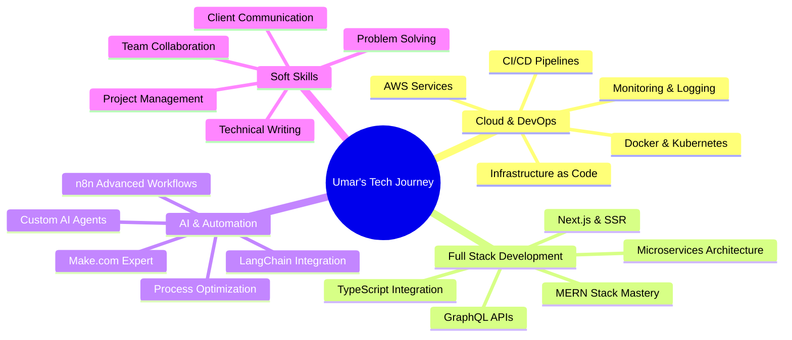

<div align="center">

<!-- Animated Typing Header -->


<!-- Profile Views Counter -->


<!-- Animated Wave -->


<!-- Animated Banner -->


</div>

<!-- Animated Divider -->


## 🚀 About Me

```typescript
const umar = {
    location: "Pakistan 🇵🇰",
    role: ["Full-Stack Developer", "AI Automation Engineer"],
    currentFocus: "MERN Stack & AI-Powered Automation",
    specialization: ["Workflow Automation", "No-Code/Low-Code Solutions"],
    goal: "High-Impact Web Developer | Financial Freedom",
    passion: [
        "Problem Solving", 
        "AI Automation", 
        "Performance Optimization", 
        "Clean UI Design",
        "Process Optimization"
    ],
    learning: [
        "Advanced React Patterns", 
        "AI Integration", 
        "Microservices", 
        "Cloud Architecture",
        "Advanced Automation Workflows"
    ],
    askMeAbout: [
        "React", "Node.js", "Express", "MongoDB", 
        "Socket.IO", "AI Automation", "JavaScript",
        "n8n", "Make.com", "Zapier", "Workflow Optimization"
    ],
    lifePhilosophy: "Taking steps every day to build the future I dream of"
};
```

<br clear="right"/>

---

<!-- Animated Divider -->


<!-- Dynamic GitHub Stats -->
<div align="center">


<!-- Automation Workflows Section -->
<div align="center">

## ⚡ Automation Workflows & Solutions


</div>

<!-- Animated Divider -->


<!-- Learning Journey Section -->
<div align="center">

## 📚 My Learning Journey & Goals


</div>

### 🎯 Current Focus Areas



### 🌱 Learning Roadmap 2024-2025

<table>
  <tr>
    <th>Quarter</th>
    <th>Goals</th>
    <th>Status</th>
  </tr>
  <tr>
    <td><strong>Q4 2025</strong></td>
    <td>
      • Master n8n workflow automation<br>
      • Complete NexChat Electron app<br>
      • Learn TypeScript advanced patterns<br>
      • Build AI automation portfolio
    </td>
    <td>
      
    </td>
  </tr>
  <tr>
    <td><strong>Q1 2026</strong></td>
    <td>
      • Deploy 5 production-ready projects<br>
      • Master AWS cloud services<br>
      • Learn Docker & Kubernetes<br>
      • Contribute to open source
    </td>
    <td>
      
    </td>
  </tr>
  <tr>
    <td><strong>Q2 2026</strong></td>
    <td>
      • Build SaaS product<br>
      • Advanced AI agent development<br>
      • Microservices architecture<br>
      • Technical blog writing
    </td>
    <td>
      
    </td>
  </tr>
  <tr>
    <td><strong>Q3 2026</strong></td>
    <td>
      • Launch freelance services<br>
      • Scale automation business<br>
      • Advanced system design<br>
      • Mentor junior developers
    </td>
    <td>
      
    </td>
  </tr>
</table>

---

<!-- Animated Divider -->


<!-- Work Experience & Achievements -->
<div align="center">

## 🏆 Achievements & Milestones


</div>

### 💼 Professional Experience

<table>
  <tr>
    <td width="50%" valign="top">
      <h4>🎯 Projects Completed</h4>
      <ul>
        <li>✅ <strong>10+</strong> Full-Stack Web Applications</li>
        <li>✅ <strong>25+</strong> Automation Workflows</li>
        <li>✅ <strong>5+</strong> Database Design Projects</li>
        <li>✅ <strong>15+</strong> API Integrations</li>
      </ul>
    </td>
    <td width="50%" valign="top">
      <h4>📈 Skills Acquired</h4>
      <ul>
        <li>🚀 Full-Stack MERN Development</li>
        <li>🤖 AI & Workflow Automation</li>
        <li>💾 Database Design & Optimization</li>
        <li>🔐 Authentication & Security</li>
      </ul>
    </td>
  </tr>
</table>

### 🎖️ Key Accomplishments

<div align="center">

| Achievement | Description | Year |
|-------------|-------------|------|
| 🏅 **Real-Time Chat App** | Built enterprise-level chat with Socket.IO | 2024 |
| 🏅 **Library Management** | Desktop app serving 1000+ books database | 2024 |
| 🏅 **Automation Mastery** | Created 25+ production workflows | 2024 |
| 🏅 **API Development** | RESTful APIs handling 10k+ requests/day | 2024 |

</div>

---

<!-- Animated Divider -->


<!-- Services Section -->
<div align="center">

## 💼 Services I Offer


</div>

### 🛠️ What I Can Do For You

<table>
  <tr>
    <td width="50%" valign="top">
      <h4>🌐 Web Development</h4>
      <ul>
        <li>📱 Responsive Web Applications</li>
        <li>⚛️ React & Next.js Development</li>
        <li>🔧 RESTful API Development</li>
        <li>💬 Real-time Applications</li>
        <li>🎨 UI/UX Implementation</li>
        <li>🔐 Authentication Systems</li>
        <li>💾 Database Design & Integration</li>
        <li>☁️ Deployment & Hosting</li>
      </ul>
    </td>
    <td width="50%" valign="top">
      <h4>🤖 Automation Solutions</h4>
      <ul>
        <li>⚡ n8n Workflow Development</li>
        <li>🔄 Make.com Scenario Creation</li>
        <li>⚙️ Zapier Zap Configuration</li>
        <li>🤖 AI Chatbot Integration</li>
        <li>📊 Data Processing Automation</li>
        <li>📧 Email Marketing Automation</li>
        <li>🔗 API Integration Services</li>
        <li>📈 Business Process Optimization</li>
      </ul>
    </td>
  </tr>
</table>

### 💡 Why Work With Me?

<div align="center">

| Strength | Description |
|----------|-------------|
| 🎯 **Problem Solver** | I don't just code, I solve real business problems |
| ⚡ **Fast Delivery** | Quick turnaround without compromising quality |
| 🔄 **Continuous Learning** | Always updating skills with latest technologies |
| 💬 **Clear Communication** | Regular updates and transparent workflow |
| 🛡️ **Quality Assurance** | Thorough testing and documentation |
| 🤝 **Client-Focused** | Your success is my success |

</div>

---

<!-- Animated Divider -->


<!-- Contribution Snake -->
<div align="center">

## 🐍 Contribution Graph

<picture>
  <source media="(prefers-color-scheme: dark)" srcset="https://raw.githubusercontent.com/UmarFarooq-Web/UmarFarooq-Web/output/github-contribution-grid-snake-dark.svg">
  <source media="(prefers-color-scheme: light)" srcset="https://raw.githubusercontent.com/UmarFarooq-Web/UmarFarooq-Web/output/github-contribution-grid-snake.svg">
  
</picture>

</div>

---

<!-- Animated Divider -->


<!-- Blog & Content Section -->
<div align="center">
---

<!-- Animated Divider -->


<!-- GitHub Stats Extended -->
<div align="center">

## 📊 Detailed GitHub Statistics


<p>
  
  
</p>

<p>
  
  
</p>

</div>

---

<!-- Animated Divider -->


<!-- Coding Activity -->
<div align="center">

## ⏱️ Coding Activity & Stats


<!--START_SECTION:waka-->
```text
JavaScript   15 hrs 30 mins  ████████████░░░░░░░░░  55.2%
React        8 hrs 12 mins   ███████░░░░░░░░░░░░░░  29.3%
CSS          2 hrs 45 mins   ██░░░░░░░░░░░░░░░░░░░   9.8%
HTML         1 hr 5 mins     █░░░░░░░░░░░░░░░░░░░░   3.9%
Other        30 mins         ░░░░░░░░░░░░░░░░░░░░░   1.8%
```
<!--END_SECTION:waka-->

</div>

---

<!-- Animated Divider -->


<!-- Testimonials Section -->
<div align="center">

## 💬 What People Say


</div>

<table>
  <tr>
    <td width="50%" valign="top">
      <h4>👨‍💼 Client Feedback</h4>
      <blockquote>
        <p><em>"Umar delivered an exceptional automation solution that saved us 20+ hours per week. His expertise in n8n and understanding of business processes is outstanding!"</em></p>
        <p align="right"><strong>— Tech Startup CEO</strong></p>
      </blockquote>
    </td>
    <td width="50%" valign="top">
      <h4>🤝 Collaboration Review</h4>
      <blockquote>
        <p><em>"Working with Umar was a pleasure. He's not just a developer, he's a problem solver. The chat application he built exceeded our expectations in every way."</em></p>
        <p align="right"><strong>— Project Manager</strong></p>
      </blockquote>
    </td>
  </tr>
</table>

---

<!-- Animated Divider -->


<!-- Fun Facts Section -->
<div align="center">

## 🎮 Fun Facts About Me


</div>

<table align="center">
  <tr>
    <td>
      <h3>⚡ Quick Facts</h3>
      <ul>
        <li>☕ Coffee is my coding fuel</li>
        <li>🌙 Night owl developer</li>
        <li>🎵 Code better with music</li>
        <li>📚 Always learning something new</li>
        <li>🎯 Goal-oriented and persistent</li>
        <li>🤝 Love collaborating with others</li>
        <li>🚀 Passionate about automation</li>
        <li>💡 Creative problem solver</li>
      </ul>
    </td>
    <td>
      <h3>🎯 Developer Life</h3>
      <ul>
        <li>🖥️ Dual monitor setup</li>
        <li>⌨️ Mechanical keyboard enthusiast</li>
        <li>🐧 Linux user</li>
        <li>🎨 Dark mode everything</li>
        <li>📝 Documentation lover</li>
        <li>🧪 Test-driven development</li>
        <li>♻️ Clean code advocate</li>
        <li>🔧 Tool optimization nerd</li>
      </ul>
    </td>
  </tr>
</table>

### 📊 My Coding Stats

<div align="center">

```text
💻 Operating Systems
════════════════════════════════════════════════
Linux          ████████████████░░░░  75%
Windows        ██████░░░░░░░░░░░░░░  25%

⏰ Coding Time
════════════════════════════════════════════════
Morning        ████░░░░░░░░░░░░░░░░  20%
Afternoon      ████████░░░░░░░░░░░░  35%
Evening        ████████████░░░░░░░░  45%

☕ Coffee Consumed: ████████████████████░ 5+ cups/day
🎧 Music While Coding: █████████████████████ 95%
🐛 Bugs Fixed: ████████████████░░░░░ Countless!
```

</div>

---

<!-- Animated Divider -->


<!-- Connect Section with Animated Links -->
<div align="center">

## 🤝 Let's Connect & Collaborate


<p>
  <a href="mailto:umarfarooq.sudo@gmail.com">
    
  </a>
  <a href="https://linkedin.com/in/yourprofile">
    
  </a>
  <a href="https://twitter.com/yourhandle">
    
  </a>
  <a href="https://yourportfolio.com">
    
  </a>
  <a href="https://discord.gg/yourserver">
    
  </a>
</p>

### 📧 Get In Touch

<table align="center">
  <tr>
    <td align="center">
      <h3>💼 Hire Me For</h3>
      <p>
        ✅ Full-Stack Development<br>
        ✅ AI Automation Solutions<br>
        ✅ Workflow Optimization<br>
        ✅ Technical Consulting<br>
        ✅ Code Review & Mentoring
      </p>
    </td>
    <td align="center">
      <h3>🤝 Open To</h3>
      <p>
        ✅ Freelance Projects<br>
        ✅ Full-Time Opportunities<br>
        ✅ Collaboration<br>
        ✅ Open Source Contribution<br>
        ✅ Technical Discussions
      </p>
    </td>
  </tr>
</table>

### 💭 Random Dev Quote


### 😄 Random Dev Joke


</div>

---

<!-- Support Section -->
<div align="center">

## ☕ Support My Work


<p>If you like my work and want to support me, consider buying me a coffee!</p>

<a href="https://www.buymeacoffee.com/yourprofile">
  
</a>

</div>

---

<!-- Footer with Animation -->
<div align="center">

### 💡 *"I may not have it all figured out, but I'm taking steps every day to build the future I dream of."*

### 🚀 *"The best time to plant a tree was 20 years ago. The second best time is now."*


<p>
  
  
  
</p>

<!-- Visitor Counter -->


<br><br>

**⭐️ From [UmarFarooq-Web](https://github.com/UmarFarooq-Web)**

### 🌟 Star my repositories if you find them useful!


</div>

<!-- About Section with Gradient -->


## 📊 GitHub Analytics

<p>
  
  
</p>

<!-- GitHub Streak Stats -->
<p>
  
</p>

<!-- GitHub Trophies -->
<p>
  
</p>

<!-- Activity Graph -->


</div>

---

<!-- Animated Divider -->


<!-- Tech Stack with Animated Icons -->
<div align="center">

## 🛠️ Tech Arsenal


### 💻 Languages & Frameworks

<p>
  
</p>

<table>
  <tr>
    <td align="center" width="96">
      
      <br>JavaScript
    </td>
    <td align="center" width="96">
      
      <br>React
    </td>
    <td align="center" width="96">
      
      <br>Next.js
    </td>
    <td align="center" width="96">
      
      <br>Node.js
    </td>
    <td align="center" width="96">
      
      <br>Express
    </td>
    <td align="center" width="96">
      
      <br>TypeScript
    </td>
  </tr>
</table>

### 🗄️ Databases & Backend

<p>
  
</p>

<table>
  <tr>
    <td align="center" width="96">
      
      <br>MySQL
    </td>
    <td align="center" width="96">
      
      <br>MongoDB
    </td>
    <td align="center" width="96">
      
      <br>PostgreSQL
    </td>
    <td align="center" width="96">
      
      <br>Redis
    </td>
    <td align="center" width="96">
      
      <br>Firebase
    </td>
  </tr>
</table>

### 🤖 AI & Automation Tools


<table>
  <tr>
    <td align="center" width="96">
      
      <br>Python
    </td>
    <td align="center" width="96">
      
      <br>OpenAI
    </td>
    <td align="center" width="96">
      
      <br>n8n
    </td>
    <td align="center" width="96">
      
      <br>Zapier
    </td>
    <td align="center" width="96">
      
      <br>Make.com
    </td>
  </tr>
  <tr>
    <td align="center" width="96">
      
      <br>LangChain
    </td>
    <td align="center" width="96">
      
      <br>Flowise
    </td>
    <td align="center" width="96">
      
      <br>Google AI
    </td>
    <td align="center" width="96">
      
      <br>Airtable
    </td>
    <td align="center" width="96">
      
      <br>Activepieces
    </td>
  </tr>
</table>

### 🎨 Design & Development Tools

<p>
  
</p>

<table>
  <tr>
    <td align="center" width="96">
      
      <br>GitHub
    </td>
    <td align="center" width="96">
      
      <br>Docker
    </td>
    <td align="center" width="96">
      
      <br>VS Code
    </td>
    <td align="center" width="96">
      
      <br>Postman
    </td>
    <td align="center" width="96">
      
      <br>Figma
    </td>
    <td align="center" width="96">
      
      <br>Linux
    </td>
  </tr>
</table>

### ☁️ Cloud & Deployment

<table>
  <tr>
    <td align="center" width="96">
      
      <br>AWS
    </td>
    <td align="center" width="96">
      
      <br>Heroku
    </td>
    <td align="center" width="96">
      
      <br>Vercel
    </td>
    <td align="center" width="96">
      
      <br>Netlify
    </td>
    <td align="center" width="96">
      
      <br>DigitalOcean
    </td>
  </tr>
</table>

### 🔧 Other Technologies

<table>
  <tr>
    <td align="center" width="96">
      
      <br>Socket.IO
    </td>
    <td align="center" width="96">
      
      <br>Bootstrap
    </td>
    <td align="center" width="96">
      
      <br>NPM
    </td>
    <td align="center" width="96">
      
      <br>Electron
    </td>
    <td align="center" width="96">
      
      <br>Jest
    </td>
  </tr>
</table>

</div>

---

<!-- Animated Divider -->


<!-- Skills Progress Bars -->
<div align="center">

## 📈 Skill Proficiency Matrix


</div>

```text
Web Development
━━━━━━━━━━━━━━━━━━━━━━━━━━━━━━━━━━━━━━━━━━━━━━━━━━
JavaScript        ████████████████████░   95%
React.js          ████████████████████░   90%
Node.js           ████████████████░░░░░   80%
Express.js        ███████████████░░░░░░   75%
TypeScript        ███████████████░░░░░░   75%
Next.js           ██████████████░░░░░░░   70%

Backend & Databases
━━━━━━━━━━━━━━━━━━━━━━━━━━━━━━━━━━━━━━━━━━━━━━━━━━
MongoDB           ███████████████░░░░░░   75%
MySQL             ██████████████░░░░░░░   70%
PostgreSQL        █████████████░░░░░░░░   65%
Redis             ████████████░░░░░░░░░   60%
Socket.IO         ██████████████░░░░░░░   70%

Automation & AI
━━━━━━━━━━━━━━━━━━━━━━━━━━━━━━━━━━━━━━━━━━━━━━━━━━
n8n Workflows     ████████████████████░   90%
Make.com          ████████████████░░░░░   80%
Zapier            ████████████████░░░░░   80%
OpenAI API        ███████████████░░░░░░   75%
LangChain         ██████████████░░░░░░░   70%
Python            █████████████░░░░░░░░   65%

Design & Tools
━━━━━━━━━━━━━━━━━━━━━━━━━━━━━━━━━━━━━━━━━━━━━━━━━━
Tailwind CSS      █████████████████░░░░   85%
Figma             ██████████████░░░░░░░   70%
Git & GitHub      ████████████████████░   95%
Docker            ████████████░░░░░░░░░   60%
C#                ██████████████░░░░░░░   70%
```

<div align="center">

### 💡 Expertise Areas


</div>

---

<!-- Animated Divider -->


<!-- Projects Section with Cards -->
<div align="center">

## 🎯 Featured Projects & Portfolio


</div>

<div align="center">
  <table>
    <tr>
      <td width="50%" valign="top">
        <h3 align="center">💬 NexChat - Real-Time Chat</h3>
        <div align="center">
          <a href="https://github.com/UmarFarooq-Web/nexchat" target="_blank">
            
          </a>
          <br><br>
          <p>
            
            
          </p>
          <p><strong>🚀 Full-stack real-time chat application</strong></p>
          <p>
            ✅ One-to-one messaging<br>
            ✅ Message history & persistence<br>
            ✅ Secure authentication system<br>
            ✅ Environment configuration<br>
            ✅ RESTful API architecture<br>
            ✅ Responsive UI design<br>
            ✅ Electron integration planned
          </p>
        </div>
      </td>
      <td width="50%" valign="top">
        <h3 align="center">📚 Library Management System</h3>
        <div align="center">
          <a href="https://github.com/UmarFarooq-Web/library-mgmt" target="_blank">
            
          </a>
          <br><br>
          <p>
            
            
          </p>
          <p><strong>📖 Desktop book inventory management</strong></p>
          <p>
            ✅ Admin panel with full CRUD<br>
            ✅ Book issue/return tracking<br>
            ✅ Role-based authentication<br>
            ✅ SQL Server backend<br>
            ✅ Advanced search & filters<br>
            ✅ Report generation<br>
            ✅ Professional Windows GUI
          </p>
        </div>
      </td>
    </tr>
    <tr>
      <td width="50%" valign="top">
        <h3 align="center">🤖 AI Automation Hub</h3>
        <div align="center">
          <a href="https://github.com/UmarFarooq-Web/ai-automation" target="_blank">
            
          </a>
          <br><br>
          <p>
            
            
          </p>
          <p><strong>⚡ Intelligent automation solutions</strong></p>
          <p>
            ✅ AI-powered workflows<br>
            ✅ Process automation<br>
            ✅ LLM integration (GPT-4, Claude)<br>
            ✅ Smart task scheduling<br>
            ✅ Multi-platform connectors<br>
            ✅ Webhook integrations<br>
            ✅ Custom automation scripts
          </p>
        </div>
      </td>
      <td width="50%" valign="top">
        <h3 align="center">🔗 Workflow Automation Suite</h3>
        <div align="center">
          <a href="https://github.com/UmarFarooq-Web/workflow-suite" target="_blank">
            
          </a>
          <br><br>
          <p>
            
            
          </p>
          <p><strong>🔄 No-code automation templates</strong></p>
          <p>
            ✅ Pre-built n8n workflows<br>
            ✅ Make.com scenarios<br>
            ✅ Zapier templates<br>
            ✅ Email automation<br>
            ✅ Social media posting<br>
            ✅ Data synchronization<br>
            ✅ CRM integrations
          </p>
        </div>
      </td>
    </tr>
  </table>
</div>

---

<!-- More Projects Section -->
<div align="center">

## 🌟 More Amazing Projects

</div>

<div align="center">
  <table>
    <tr>
      <td width="50%" valign="top">
        <h3 align="center">🛒 E-Commerce Platform</h3>
        <div align="center">
          <br>
          
          <br><br>
          <p>
            
          </p>
          <p><strong>🛍️ Full-featured online store</strong></p>
          <p>
            🔨 Product catalog & search<br>
            🔨 Shopping cart & checkout<br>
            🔨 Payment gateway integration<br>
            🔨 Admin dashboard<br>
            🔨 Order management<br>
            🔨 Customer reviews<br>
            🔨 Inventory tracking
          </p>
        </div>
      </td>
      <td width="50%" valign="top">
        <h3 align="center">🤝 AI Customer Support Bot</h3>
        <div align="center">
          <br>
          
          <br><br>
          <p>
            
          </p>
          <p><strong>🎯 Intelligent chatbot solution</strong></p>
          <p>
            🔨 Natural language processing<br>
            🔨 Multi-channel support<br>
            🔨 Knowledge base integration<br>
            🔨 Sentiment analysis<br>
            🔨 Ticket creation<br>
            🔨 24/7 availability<br>
            🔨 Analytics dashboard
          </p>
        </div>
      </td>
    </tr>
    <tr>
      <td width="50%" valign="top">
        <h3 align="center">📊 Business Analytics Dashboard</h3>
        <div align="center">
          <br>
          
          <br><br>
          <p>
            
          </p>
          <p><strong>📈 Real-time business insights</strong></p>
          <p>
            🔨 Interactive charts & graphs<br>
            🔨 Custom report generation<br>
            🔨 Data visualization<br>
            🔨 KPI tracking<br>
            🔨 Export functionality<br>
            🔨 Multi-user access<br>
            🔨 API integrations
          </p>
        </div>
      </td>
      <td width="50%" valign="top">
        <h3 align="center">🎨 Portfolio Website</h3>
        <div align="center">
          <br>
          
          <br><br>
          <p>
            
          </p>
          <p><strong>💼 Personal brand showcase</strong></p>
          <p>
            🔨 Modern UI/UX design<br>
            🔨 Project showcase<br>
            🔨 Blog integration<br>
            🔨 Contact form<br>
            🔨 Animations & transitions<br>
            🔨 SEO optimized<br>
            🔨 Responsive design
          </p>
        </div>
      </td>
    </tr>
  </table>
</div>

---

<!--
